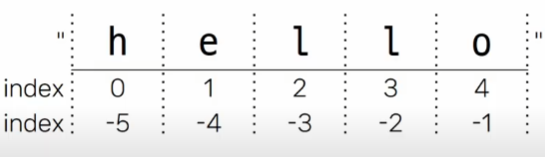
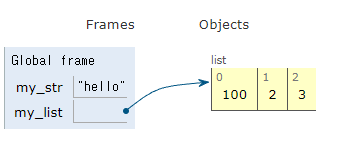

# Data Type

:값의 종류와 그 값에 적용 가능한 연산과 동작을 결정하는 속성

---
- [Data Type](#data-type)
  - [**int** : 정수 자료형](#int--정수-자료형)
  - [**float** : 실수 자료형](#float--실수-자료형)
  - [Sequence Types](#sequence-types)
    - [str(문자열)](#str문자열)
    - [list(리스트)](#list리스트)
    - [tuple(튜플)](#tuple튜플)
    - [range](#range)
  - [Non-Sequence](#non-sequence)
    - [dict(딕셔너리)](#dict딕셔너리)
    - [set(세트)](#set세트)
  - [Other Type](#other-type)
    - [None](#none)
    - [Boolean](#boolean)
- [Collection](#collection)
----
- 데이터 타입이 필요한 이유
   - 값들을 구분하고, 어떻게 다뤄야 하는지를 알 수 있음
   - 각 데이터 타입 값들은 각자에게 적합한 도구를 가짐
## **int** : 정수 자료형
- 2진수 : 0b
- 8진수 : 0o
- 16진수 : 0x
    ```python
    print(0b10) # 2
    print(0o30) # 24
    print(0x10) # 16

    # 진법 변경
    print(bin(12)) # 0b1100
    print(oct(12)) # 0o14
    print(hex(12)) # 0xc
    ```
## **float** : 실수 자료형
- 프로그래밍 언어에서 float는 실수에 대한 **근삿값**
- 유한 정밀도 : 컴퓨터 메모리 용량이 한정되어 있어서 한 숫자에 대해 저장하는 용량이 제한됨 -> 그래서 근삿값으로 저장
- 실수 연산 시 주의사항
  - 컴퓨터는 2진수, 사람은 10진법
  - Floating point rounding error
    ```python
    a = 3.2 - 3.1 # 0.10000009
    b = 1.2 - 1.1 # 0.09999999

    # 1. 임의의 작은 수 활용
    print(abs(a - b) <= 1e-10) #True

    # 2. math 모듈 활용
    import math
    print(math.isclose(a,b)) #True
    ```
- 지수 표현 방식 : e 또는 E를 사용
    ```python
    # 314 * 0.01
    number = 314e-2

    print(type(number)) # float

    print(number) # 3.14
    ```
## Sequence Types 
: 여러 개의 값을 순서대로 나열하여 저장하는 자료형
   - 순서 : 값들이 순서대로 저장 (정렬 X)
   - 인덱싱(Indexing) : 각 값에 고유한 인덱스(번호)를 가지고 있으며, 인덱스를 사용하여 특정 위치의 값을 선택하거나 수정할 수 있음
   -  슬라이싱(Slicing) : 인덱스 범위를 조절해 부분적인 값을 추출할 수 있음
   -  길이 (Length) :  len() 함수를 사용하여 저장된 값의 길이(개수)를 구할 수 있음
   -  반복(Iteration) : 반복문을 사용하여 저장된 값들을 반복적으로 처리할 수 있음
  
### str(문자열)
:문자들의 순서가 있는 변경 불가능한 자료형
```python
print(type('Hello World')) #str
```
- Escape sequence : 역슬래시 뒤에 특정 문자가 와서 특수한 기능을 하는 문자 조합
  |예약 문자|내용(의미)|
  |---|---|
  | \n | 줄 바꿈 |
  | \t | 탭 |
  | \\ | 백슬래시 |
  | \' | 작은 따옴표 |
  | \" | 큰 따옴표 |
- String Interpolation : 문자열 내에 변수나 표현식을 삽입하는 방법
  - f-string : 문자열에 f 또는 F 접두어를 붙이고 표현식을 {expression}로 작성하여 문자열에 파이썬 표현식의 값을 삽입할 수 있음
  ```python
  bugs = 'roaches'
  counts = 13
  area = 'living room'

  #Debugging roaches 13 living room
  
  print(f'Debugging {bugs} {counts} {area}')
  
  # 다른 방법들
  
  print('Debugging {} {} {}'.format(bugs, counts, area))
  print('Debugging %s %d %s' % (bugs, counts, area))
  ```
  ```python
  # f-string 응용

  greeting = 'hi'
  print(f'{greeting:>10}') # 왼쪽 정렬
  print(f'{greeting:^10}') # 가운데 정렬
  print(f'{greeting:<10}') # 오른쪽 정렬
  print(f'{3.141592:.4f}') # 3.1416

  ```
- 문자열의 시퀀스 특징
    ```python
    my_str = 'hello'

    # 인덱싱
    print(my_str[1])  # e

    # 슬라이싱
    print(my_str[2:4])  # ll

    # 길이
    print(len(my_str))  # 5
    ```
- index와 slicing
  
  
  - 위의 hello에서 print(my_str[2:4])를 하면 ll만 출력이 됨 -> 각각의 인덱스를 공백이라고 생각하면 편함
  - step을 지정해서 추출:
    ```python
    # 중간중간 뛰어서 출력
    my_str[0:5:2] #hlo

    # 거꾸로 출력
    my_str[::-1] #olleh
    ```
- 문자열은 불변(변경 불가)
  
### list(리스트)
: *변경 가능한* 시퀀스 자료형
- 리스트 표현
  - 0개 이상의 객체를 포함하며 데이터 목록을 저장
  - 대괄호([])로 표기
  - 데이터는 어떤 자료형으로도 저장가능
    ```python
    my_list1 = []
    my_list2 = [1, 'a', 3, 'b', 5]
    my_list3 = [1, 2, 3, ['hello', 'world']]
    ```
    ```python
    my_list = [1, 2, 3, 'python', ['hello', 'world', '!!!']]
    print(len(my_list)) #5
    print(my_list[4][-1]) #'!!!'
    print(my_list[-1][1][0]) # w
    ```
- 리스트는 ***가변***
    ```python
    my_list = [1, 2, 3]
    my_list[0] = 100

    print(my_list) # [100, 2, 3]
    ```

### tuple(튜플)
: 리스트와 비슷하지만 변경불가능

- 튜플 표현 
  - 0개 이상의 객체를 포함하며 데이터 목록 저장
  - 소괄호(())로 표기
  - 데이터는 어떤 자료형도 저장 가능
- 튜플은 불변(변경 불가)
    ```python
    my_tuple = (1, 'a', 3, 'b', 5)

    my_tuple[1] = 'z'
    # TypeError
    ```
- 어디다 쓸까? : 파이썬 내부 동작에서 많이 쓰임(크게 신경 안써도 됨)
  
### range
연속된 정수 시퀀스를 생성하는 변경 불가능한 자료형
- range(n) : 0부터 **n-1**까지의 숫자 시퀀스
- range(n,m) : n부터 **m-1**까지의 숫자 시퀀스
  ```python
  myrange = range(5)

  print(myrange) # range(5)

  # 리스트로 형 변환시 데이터 확인 가능
  print(list(myrange)) # [0, 1, 2, 3, 4]
  ```

## Non-Sequence
### dict(딕셔너리)
key-value 쌍으로 이루어진 순서와 중복이 없는 변경 가능한 자료형
- key는 변경 불가능한 자료형만 사용가능(str, int, float, tuple, range...)
- value는 모든 자료형 사용가능
- 중괄호({})로 표기
- key를 통해 value에 접근
  ```python
  my_dict = {'apple' : 12, 'list' : [1, 2, 3]}

  print(my_dict['apple']) # 12

  # 값 변경
  my_dict['apple'] = 100
  print(my_dict) # {'apple' : 100, 'list' : [1, 2, 3]}
  ```
  ```python
  my_dict = {
    'a1' : {'b1' : 1,'b2' : 2, 'b3' : 3},
    'a2' : {'b4' : 4,'b5' : 5, 'b6' : 5},
    'a3' : {'b7' : 7,'b8' : 8, 'b9' : 9}
  }

  result1 = my_dict['a2']['b5'] # 5

  result2 = my_dict.get('a2').get('b2') # 5
  ```

### set(세트)
순서와 중복이 없는 변경 가능한 자료형
- 수학에서의 집합과 동일한 연산 처리 가능
- 중괄호({})로 표기
  ```python
  my_set1 = set() # {}는 딕셔너리가 되버림
  my_set2 = {1, 2, 3}
  my_set3 = {1, 1, 1}

  print(my_set1) # set()
  print(my_set2) # {1, 2, 3}
  print(my_set3) # {1} : 중복이 안됨
  ```
- 집합 연산
  ```python
  my_set1 = {1, 2, 3}
  my_set2 = {3, 6, 9}

  # 합집합
  print(my_set1 | my_set2) #{1, 2, 3, 6, 9}

  # 차집합
  print(my_set1 - my_set2) #{1, 2}

  # 교집합
  print(my_set1 & my_set2) #{3}
  ```
- set의 사용예시
  ```python
  # 세트의 사용 예시 : 로또 번호 추첨

  import random

  lotto = set()

  while len(lotto) <= 6:
    number = random.randint(1,45)
    lotto.add(number)

  lotto = list(lotto)
  lotto.sort()
  print(f'이번주 당첨 번호는 {lotto}입니다')
  ```

## Other Type
### None
파이썬에서 '값이 없음'을 표현하는 자료형

### Boolean
참(True)과 거짓(False)를 표현하는 자료형
- 비교 / 논리 연산의 평과 결과로 사용
- 주로 조건 / 반복문과 함께 사용
  
# Collection
: 여러 개의 항목 또는 요소를 담는 자료 구조 (str, list, tuple, set, dict)

| 컬렉션 | 변경가능여부 | 순서 |
|:---:|:---:|:---:|
str | x | ㅇ
list | o | o
tuple| x | o
set | o | x
dict | o | x

```python
# 불변과 가변
my_str = 'hello'
my_str[0] = 'z' #error

my_list = [1, 2, 3]
my_list[0] = 100
print(my_list) # [100, 2, 3]
```


str은 문자열을 통채로 저장, list는 각각의 칸에 저장

- 가변 데이터들의 특징
```python
list1 = [1, 2, 3]
list2 = list1

list1[0] = 100
print(list1) #[100, 2, 3]
print(list2) #[100, 2, 3]
```
