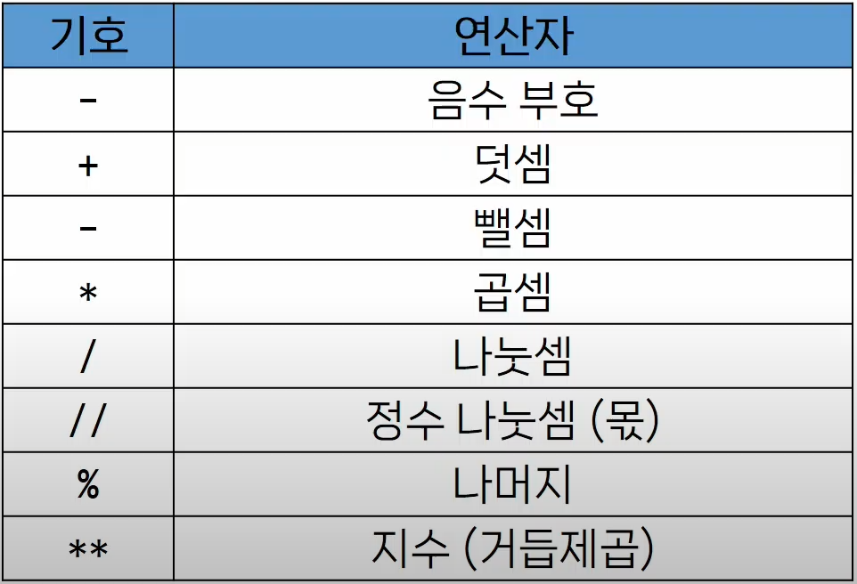

# Python 개요

### 파이썬 인터프리터

- 파이썬 프로그램 > **파이썬 인터프리터** > 운영체제
- 파이썬 인터프리터를 사용하는 방법
    1. shell 프로그램으로 한번에 한 명령어씩 (cmd -> python -i 입력)
    2. .py 파일을 만들어서 실행(주로 이런 방법 이용)

### 표현식과 값

- **표현식**: 값, 변수, 연산자 등을 조합하여 계산되고 결과를 내는 코드 구조
- **평가**: 표현식이나 문장을 실행하여 그 결과를 계산하고 값을 구하는 과정
- **문장**: 실행 가능한 동작을 기술하는 코드
  (조건문, 반복문, 함수 정의 등)

### 타입
- 타입: 값이 어떤 종류의 데이터인지, 어떻게 해석되고 처리되어야 하는지를 정의
  1. 값(피연산자)
  2. 연산자
    #### 데이터 타입
    - Numeric Type : int(정수), float(실수), complex(복소수)
    - Sequence Types(순서O) : list, tuple, range
    - Text Sequence Type : str(문자열)
    - Set Types(집합) : set
    - Mapping Types : dict
    - 기타 : None, Boolean(True/False), Functions
   #### 산술연산자
   
- 연산자 우선순위
  : 지수 -> 음수부호 -> 곱셉,나눗셈,정수 나눗셈, 나머지 -> 덧셈,뻴셈

## 변수와 메모리
#### 변수(variable)
:값을 *참조*하는 이름

```python
degrees = 36.5 #할당
```

- 변수명 규칙
  - 영문 알파벳, 언더스코어(_), 숫자로 구성
  - 숫자로 시작할 수 없음
  - 대소문자 구분
  - 이미 있는 명령어 등은 사용 불가능
- 메모리에는 그 위치를 식별하는 메모리 주소가 존재함 -> 메모리 주소가 매우 길고 쓰기 힘든 -> 주소를 변수에 저장
- **객체(Object)**: 타입을 갖는 메모리 주소 내 값, 값이 들어있는 상자
- **할당문**
  - 할당 연산자(=) 오른쪽에 있는 표현식을 평가에서 값(메모리 주소)를 생성
  - 변수의 재할당
  ```python
  number = 10
  double = 2 * number #이때 20 저장되고 끝
  print(double) #20

  number = 5 #number가 바껴도 double은 그래도임
  print(double) #20
  ```

## Style Guide
:코드의 일관성과 가독성을 향상시키기 위한 규칙과 권장 사항들의 모음

- 변수명은 무엇을 위한 변수인지 직관적인 이름을 가져야 함
- *공백 4칸*을 사용하여 코드 블록을 들여쓰기
- 한 줄의 길이는 79자로 제한, 길어지면 줄 바꿈
- 문자와 밑줄(_)을 사용하여 함수,변수, 속성의 이름을 작성(snake case)
- 함수 정의나 클래스 정의 등의 블록 사이에는 빈 줄을 추가
- 그 외의 참고 [링크](https://peps.python.org/pep-0008/)
    ```python
    num = 1
    numbers = [1, 2, 3]
    seconds = 60
    # 상수
    SECONDS = 50 #상수는 주로 대문자로
    SECONDS_PER_MINUTE = 30
    ```

## python Tutor
: 코드의 라인마다 진행사항을 볼 수 있음

## 주석
- 프로그램 코드 내에 작성되는 설명이나 메모
- 인터프리터에 의해 실행되지 않음
```python
#이것은 
age = 10
#주석입니다

"""
여러줄 주석도 가능해요
"""

# 아니면 여러줄 잡아서
# 이렇게 
# 컨트롤 슬래시 (crtl+/) 
# 푸는것도 똑같이 하면 됩니당

```
- 주석의 목적
  - 코드의 특정 부분을 설명하거나 임시로 코드를 비활성화할 때
  - 코드를 이해하거나 문서화하기 위해
  - 다른 개발자나 자신에게 코드의 의도나 동작을 설명하는 데에 도움(미래의 나를 위해...)


[def]: image.png
